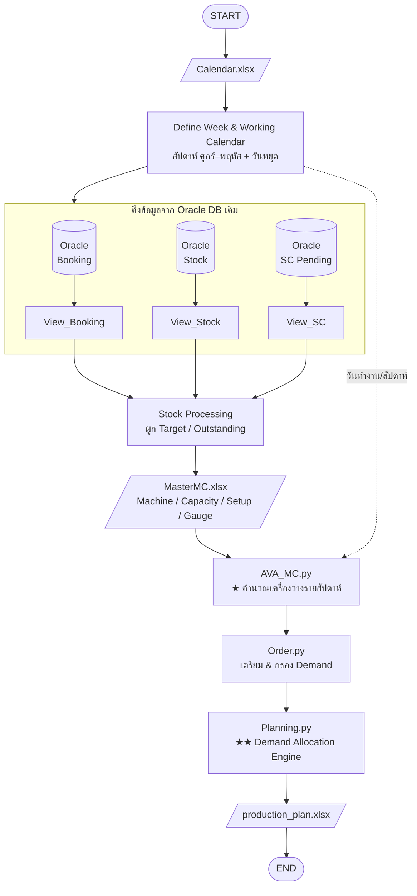
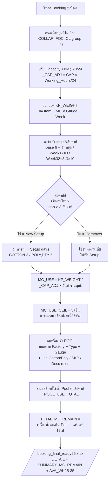
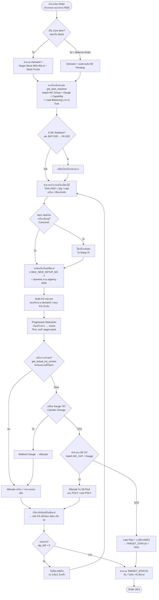
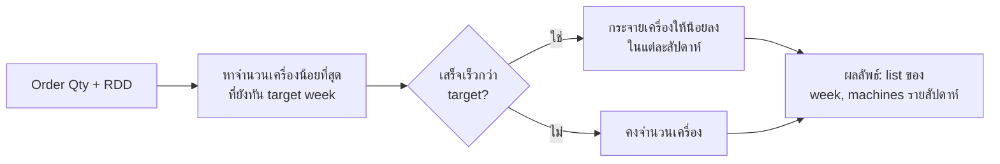
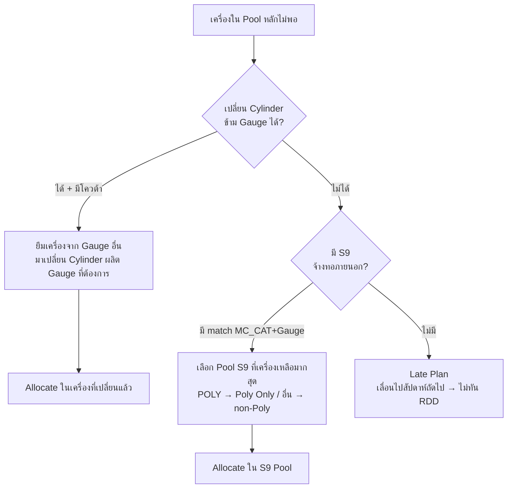

# AS-IS Process — AI Knit Planning System
### บริษัท นันยางเท็กซ์ไทล์ (Nan Yang Textile)
### เอกสารสรุป Business Logic & Process Flow สำหรับ ERP Implementation (Oracle)

> เอกสารนี้สรุปกระบวนการทำงานปัจจุบัน (AS-IS) ของระบบวางแผนการผลิตผ้าถัก (Knit Production Planning)
> เพื่อให้ Vendor นำไปออกแบบ Solution / Interface บน Oracle ERP ตัวใหม่

---

## 1. ภาพรวมระบบ (System Overview)

ระบบ AI Knit Plan ทำหน้าที่ **วางแผนการผลิตผ้าถัก (Greige Knitting)** โดยรับความต้องการ (Demand/Order) มาจัดสรรลงเครื่องถัก (Knitting Machine) ในแต่ละสัปดาห์ ภายใต้ข้อจำกัดของกำลังการผลิต (Machine Capacity) เวลา Setup เครื่อง และกำหนดส่งงาน (RDD/FG Week)

**ผลลัพธ์หลัก:** ตารางแผนการผลิตรายสัปดาห์ — ระบุว่า *Item ใด ผลิตที่เครื่องกลุ่มไหน Gauge เท่าไร ใช้กี่เครื่อง สัปดาห์ใด ผลิตได้กี่กิโล และทันกำหนดส่งหรือไม่*

ระบบทำงานเป็น **Batch Pipeline** (รันเป็นรอบ ไม่ใช่ real-time) เขียนด้วย Python ดึงข้อมูลจาก Oracle DB เดิม + ไฟล์ Master (Excel) แล้วประมวลผลออกเป็นไฟล์ Excel

```
INPUT (Oracle DB + Master Excel)  →  ENGINE (Python)  →  OUTPUT (Production Plan Excel)
```

---

## 2. แหล่งข้อมูล (Data Sources)

### 2.1 จาก Oracle Database เดิม (`172.16.7.55:1521`, Service: `NYTG`)

| View / Source | ใช้ทำอะไร | Script |
|---|---|---|
| `BI_DATA_GREIGE_STOCK_KP` | Stock ผ้าดิบคงคลัง (On-hand) รายคลัง/รายตัว | View_Stock.py |
| `nyf.DFIV_KP_BOOKING@NYKPB.WORLD` | Booking — แผน/ยอดงานที่จองเครื่องไว้แล้ว + Capacity ของเครื่อง | View_Booking.py |
| `BI_DATA_SC_PENDING_HL` | Sales Contract (SC) ที่ยังค้างผลิต (Pending) = Demand หลัก | View_SC.py |

### 2.2 จากไฟล์ Master (Excel — ปัจจุบันเก็บใน SharePoint/OneDrive)

| ไฟล์ | เนื้อหา | สำคัญต่อ Logic |
|---|---|---|
| `MasterMC.xlsx` | ทะเบียนเครื่องจักรทั้งหมด: Factory, Type, MC Group, Gauge, จำนวนเครื่อง (Total MC), Working Hours, Working Day, Setup time | **หัวใจของกำลังการผลิต** |
| `MasterMC.xlsx → sheet "Item Special"` | Override เวลาทำงาน (Working day/hour) รายตัว Item เฉพาะ | ปรับ Capacity เฉพาะกรณี |
| `MasterMC.xlsx → sheet "MC Special"` | แยกเครื่อง COTTON/POLY + กฎพิเศษตาม Description | แยก Pool เครื่อง |
| `MasterMC.xlsx → sheet "MC S9"` | เครื่องของผู้รับจ้างทอ (S9 / Subcontract) | Routing งานจ้างทอ |
| `Calendar.xlsx` | ปฏิทินการผลิต — กำหนดวันทำงาน/วันหยุด รายวัน | นิยามสัปดาห์ + วันทำงาน |
| `Target_Stock.xlsx` | Stock MIN/MAX เป้าหมายรายตัว (Core Item) | คำนวณ Demand ของ Core Item |
| `Itemcore.xlsx` | ทะเบียน Core Item (สินค้าผลิตเก็บ Stock) | แยก Make-to-Stock vs Make-to-Order |

> **ประเด็นสำคัญสำหรับ Vendor:** ข้อมูล Master เหล่านี้ (โดยเฉพาะ MasterMC) ปัจจุบันอยู่ในไฟล์ Excel ที่ Planner ดูแลเอง — เป็นจุดที่ ERP ใหม่ควรพิจารณายกขึ้นเป็น **Master Data บนระบบ** (Machine Master, Routing, Capacity, Calendar)

---

## 3. Process Flow ทั้งระบบ (End-to-End Pipeline)

```
┌─────────────────────────────────────────────────────────────────────────┐
│                         PILEINE (run_all.py)                             │
└─────────────────────────────────────────────────────────────────────────┘

 STEP 1   Calendar.py     โหลดปฏิทิน → นิยามสัปดาห์ (ศุกร์–พฤหัส) + วันทำงาน/วันหยุด
            │
 STEP 2   View_Booking.py ดึง Booking 3 สัปดาห์ล่าสุดจาก Oracle → Booking/view_booking.xlsx
            │
 STEP 3   View_Stock.py   ดึง Stock คงคลังจาก Oracle → Stock/view_stock.xlsx
            │
 STEP 4   View_SC.py      ดึง SC Pending (Demand) จาก Oracle → Order/view_sc.xlsx
            │
 STEP 5   Stock.py        กรอง Stock + ผูก Outstanding/Target → filtered_stock_data.xlsx
            │
 STEP 6   AVA_MC.py       ★ คำนวณ "เครื่องว่าง" (Machine Availability) รายสัปดาห์
            │                 → data_plan/booking_final_ready25.xlsx
 STEP 7   Order.py        เตรียม/กรอง Order (Demand) → data_plan/order_ready.xlsx
            │
 STEP 8   Planning.py     ★★ ENGINE หลัก: จับคู่ Demand ↔ เครื่องว่าง รายสัปดาห์
                              → data_plan/production_plan_DD-MM-YYYY.xlsx  (แผนผลิตสุดท้าย)
```

**2 STEP ที่เป็นหัวใจ:** `AVA_MC.py` (คำนวณ Supply = เครื่องว่าง) และ `Planning.py` (จัดสรร Demand ลงเครื่อง)

---

## 4. นิยามและกฎทางธุรกิจหลัก (Core Business Rules)

### 4.1 นิยามสัปดาห์ (Week Definition) — สำคัญมาก
- **1 สัปดาห์ผลิต = วันศุกร์ → วันพฤหัสบดี** (ไม่ใช่ จันทร์–อาทิตย์)
- คำนวณโดย: นำวันที่ + 3 วัน แล้วใช้ ISO Week (`date + 3 days → ISO week`)
- ปฏิทินบริษัทสามารถ **กำหนด Week เอง** ได้ (เช่น Week 17 ครอบช่วงสงกรานต์) — ระบบจะอ่าน Week/Year จากไฟล์ Calendar ก่อน ถ้าไม่มีจึงคำนวณเอง

### 4.2 วันทำงานต่อสัปดาห์ (Working Days)
- ฐานปกติ = **6 วัน/สัปดาห์** (อาทิตย์หยุด)
- หักวันหยุดพิเศษตามปฏิทิน (Calendar status = 0 คือวันหยุด ห้ามวางแผน)
- สัปดาห์พิเศษ override: **Week 17 = 8 วัน**, **Week 32 = 8 หรือ 10 วัน** (ตาม REMARK ใน MasterMC)

### 4.3 กฎ 20/24 ชั่วโมง (Working Hours Adjustment)
- เครื่องบางกลุ่มเดินแค่ 20 ชม./วัน (ไม่ใช่ 24) → กำลังผลิตถูกปรับ **× (20/24)**
- ค่า Working Hours อ่านจาก MasterMC รายเครื่อง; `Item Special` override รายตัวได้

### 4.4 เวลาเซ็ตเครื่อง (Setup Days) — เสียกำลังผลิตช่วงตั้งเครื่อง
ลำดับการตัดสิน:
1. ถ้า MasterMC ระบุ "Set up time" ของเครื่องนั้น → ใช้ค่านั้น
2. วัสดุ **COTTON บริสุทธิ์** → **3 วัน**
3. วัสดุ **POLY** → **5 วัน**
4. วัสดุอื่น (CD/TC/CVC) หรือใช้เส้นด้าย DTY → **5 วัน**
5. Default → 3 วัน
- **ไม่ Setup ซ้ำ** ถ้า Item/เครื่องเดิมรันต่อเนื่อง (ช่วงห่าง ≤ 3 สัปดาห์ = SETUP_GAP_WEEK) → เรียกว่า **Carryover**

### 4.5 Machine Pool — การรวม/แยกกลุ่มเครื่อง
เครื่องที่ "ใช้แทนกันได้" จะถูกจัดเป็น **Pool เดียวกัน** เพื่อแชร์กำลังการผลิต โดยแยกตาม:
- **Factory** (เครื่องคนละโรงงานไม่นำมารวมกัน)
- **Type + Gauge** (เช่น SINGLE-32 Gauge 24)
- กฎพิเศษ: แยก Pool COTTON/POLY ตาม prefix ของ Item (FD5/F5 = Cotton, FD4/F4 = Poly), เครื่อง SKP แยกเดี่ยว, กฎตาม Description (เช่น French Terry)

### 4.6 งานจ้างทอ S9 (Subcontract Routing)
- บาง Item/เครื่องสามารถส่งให้ผู้รับจ้างทอภายนอก (S9) ได้
- มี Pool เครื่อง S9 แยก (sheet MC S9) แยก POLY / non-POLY
- ระบบเลือก S9 เมื่อเครื่องในบริษัทไม่พอ/ไม่ทัน RDD โดย match ตาม MC_CAT + Gauge

### 4.7 MC Group Redirect
- บางเครื่องกำหนดให้ส่งงานไปเครื่องอื่นแทนเสมอ (เช่น `SKP G20 → FA G20` ให้โรงอ้อมน้อยรับผลิตแทน)

---

## 5. STEP 6 — AVA_MC.py : คำนวณกำลังเครื่องว่าง (Supply)

**วัตถุประสงค์:** หาว่าแต่ละสัปดาห์ แต่ละกลุ่มเครื่อง **เหลือเครื่องว่างกี่เครื่อง** หลังหักงานที่ Booking ไว้แล้ว

**ขั้นตอน:**
1. โหลด Booking ทั้งหมด → กรองทิ้งกลุ่มที่ไม่เกี่ยว (COLLAR, FQC, เครื่องกลุ่ม CL ฯลฯ)
2. ปรับ Capacity ตามกฎ 20/24 (`_CAP_ADJ`)
3. รวมยอด (KP_WEIGHT) ตาม Item × เครื่อง × Gauge × สัปดาห์
4. คำนวณ **จำนวนเครื่องที่ต้องใช้ (MC_USE)** ของแต่ละงาน:
   ```
   MC_USE = KP_WEIGHT / (Capacity/วัน × วันทำงานสุทธิ)
   MC_USE_CEIL = ปัดขึ้น (จำนวนเครื่องจริง)
   ```
5. หัก Setup: สัปดาห์ที่เริ่มงานใหม่ วันทำงานลดลงตาม Setup days; ถ้า carryover ไม่หัก
6. **TOTAL_MC_REMAIN = จำนวนเครื่องทั้งหมดใน Pool − เครื่องที่ใช้ไปแล้วในสัปดาห์นั้น**

**Output:** `booking_final_ready25.xlsx`
- Sheet `DETAIL` — รายละเอียดทุกงาน
- Sheet `SUMMARY_MC_REMAIN` — เครื่องว่างรายสัปดาห์ต่อกลุ่ม
- Sheet `AVA_WK25-35` — ตาราง % เครื่องว่าง รายสัปดาห์ (ไฮไลต์แดงเมื่อว่าง ≤ 20%)

---

## 6. STEP 8 — Planning.py : ENGINE จัดสรรงานลงเครื่อง (Demand → Supply)

นี่คือสมองของระบบ (11,700+ บรรทัด) จับคู่ Order (Demand) กับเครื่องว่าง (จาก AVA_MC) ทีละ Order

### 6.1 เตรียมข้อมูล
- รวม Order ที่เป็นงานเดียวกัน (SC + SO + Item + Gauge + FG Week เดียวกัน → รวมยอด)
- แยก **Core Item (ผลิตเก็บ Stock)** กับ **Make-to-Order** — Core Item คำนวณ Demand จาก Target Stock (MIN×สัปดาห์) − Stock ปัจจุบัน

### 6.2 หลักการจัดสรรต่อ Order (ลำดับการตัดสินใจ)
สำหรับแต่ละ Order ระบบจะ:

1. **หาเครื่องที่เหมาะสม** (`get_best_machine_for_item`) — match MC Group + Gauge + Capability; พิจารณา Load Balancing (กระจายงานไม่ให้เครื่องกระจุก)
2. **คำนวณจำนวนเครื่องที่ต้องใช้** ให้ทันกำหนดส่ง (`calculate_required_machines`):
   - ดูจาก ยอด (Qty) ÷ กำลังผลิตต่อเครื่อง ÷ จำนวนสัปดาห์ที่เหลือถึง RDD
3. **Carryover-first** — ถ้า Item เดิมยังรันเครื่องเดิมอยู่ ให้ใช้ต่อ (ไม่ Setup ซ้ำ)
4. **Progressive Reduction** (`calculate_progressive_reduction`) — เริ่มด้วยเครื่องมากในสัปดาห์แรกแล้วค่อยๆ ลด เพื่อให้งานเสร็จ **พอดี** target week (ไม่เร็ว/ช้าเกิน) — ประหยัดเครื่อง
5. **เพดานเครื่องใหม่ต่อสัปดาห์** — เปิด setup เครื่องใหม่ได้ไม่เกิน `MAX_NEW_SETUP_MC = 2` ต่อ Item/สัปดาห์ (และ dynamic ตามความเร่งด่วนของ RDD)
6. **ตรวจเครื่องว่างจริง** (`get_actual_mc_remain`) — หักเครื่องที่แผนรอบนี้ใช้ไปแล้ว ป้องกันจองเกิน
7. **S9 / Cylinder change / Redirect** — ถ้าเครื่องในบริษัทไม่พอ ลองเปลี่ยน Gauge (Cylinder change) หรือส่งจ้างทอ S9
8. **เก็บกำลังที่เหลือในสัปดาห์** ไปผลิต FG ถัดไปของ Item เดียวกันต่อ (ใช้เครื่องคุ้ม)

### 6.3 เป้าหมายของ Algorithm (Objective)
- ผลิต **ให้ทันกำหนดส่ง (RDD/FG Week)** เป็นอันดับแรก
- ใช้เครื่อง **คุ้มค่าที่สุด** (เต็มกำลัง แต่ไม่เกินจำเป็น)
- กระจายโหลดให้สมดุล (Load Balancing)
- ลด Setup ที่ไม่จำเป็น (Carryover)

### 6.4 Output: `production_plan_DD-MM-YYYY.xlsx` (พ.ศ.)
แผนผลิตรายสัปดาห์ ระบุต่อบรรทัด:
- Item Code, SC/SO, Customer, สี
- MC Group + Gauge + Factory ที่จะผลิต
- PLAN_WEEK (สัปดาห์ผลิต), จำนวนเครื่อง, ยอดผลิต (Kg)
- TARGET_KNIT (สัปดาห์เป้าหมาย) และ **TARGET_STATUS** = "ทัน" / "ไม่ทัน (+N สัปดาห์)"

---

## 7. สรุป Data Flow (Demand & Supply)

```
        ┌──────────── SUPPLY (กำลังเครื่อง) ────────────┐
        │                                               │
  MasterMC.xlsx ──► เครื่องทั้งหมด/Pool/Capacity        │
  Calendar.xlsx ──► วันทำงานต่อสัปดาห์                  │
  Booking (Oracle) ──► เครื่องที่ถูกจองไว้แล้ว           │
        │                                               ▼
        │                                    [AVA_MC.py] ──► เครื่องว่างรายสัปดาห์
        │                                               │
        └───────────────────────────────────────────┐  │
                                                      ▼  ▼
        ┌──────────── DEMAND (ความต้องการ) ─────┐  [Planning.py]  ◄── จับคู่ Demand↔Supply
        │                                       │       │
  SC Pending (Oracle) ──► Order ที่ค้างผลิต ─────┘       │
  Target_Stock + Stock ──► Demand ของ Core Item ─────────┤
  Itemcore.xlsx ──► แยก Core / Make-to-Order ────────────┘
                                                          ▼
                                          ★ PRODUCTION PLAN (แผนผลิตรายสัปดาห์)
```

---

## 8. ประเด็นสำคัญสำหรับการออกแบบ ERP ใหม่ (Notes for Vendor)

| หัวข้อ | สถานะปัจจุบัน (AS-IS) | ข้อเสนอเชิงออกแบบ |
|---|---|---|
| Machine Master / Capacity | เก็บใน Excel (MasterMC) ที่ Planner ดูแล | ยกขึ้นเป็น Master Data + Routing/Work Center บน ERP |
| ปฏิทินการผลิต (Fri–Thu week) | ไฟล์ Calendar.xlsx + กฎ +3 วัน | Factory Calendar / Shop Calendar ที่กำหนด week เองได้ |
| Demand | ดึงจาก SC Pending + Target Stock | MRP / Planned Order จาก Sales + Inventory Policy |
| กำลังการผลิต & Setup | คำนวณใน Python (20/24, Setup days, Pool) | Capacity Planning + Changeover Matrix |
| Subcontract (S9) | sheet Excel + logic ใน Python | Subcontract Routing / External Operation |
| ผลลัพธ์ | ไฟล์ Excel รายรอบ | Production Schedule / Planned Production Order |
| รูปแบบทำงาน | Batch (รันเป็นรอบ) | กำหนดรอบ MRP run / Scheduling run |

**จุดที่ Logic ซับซ้อนและต้องสื่อสารให้ Vendor เข้าใจชัด:**
1. นิยามสัปดาห์ ศุกร์–พฤหัส (ไม่ใช่มาตรฐาน ISO)
2. การรวมเครื่องเป็น Pool (แชร์กำลังข้าม MC Group แต่แยกตาม Factory)
3. การไม่ Setup ซ้ำเมื่อ Carryover (ผลต่อ Capacity จริง)
4. Progressive Reduction — เกลี่ยเครื่องให้จบพอดี deadline
5. การแยก COTTON/POLY pool ตาม prefix ของ Item Code
6. งานจ้างทอ S9 เป็น routing ทางเลือกเมื่อในบริษัทไม่พอ

---

# ภาคผนวก: Flow Diagram แบบละเอียด (Detailed Flow)

> Diagram ทั้งหมดเป็น **Mermaid** — render ได้ใน VS Code (ส่วนขยาย Markdown Preview Mermaid), GitHub,
> Confluence, Notion, draw.io หรือ https://mermaid.live

---

## A. Flow ภาพรวมทั้ง Pipeline (End-to-End)



---

## B. AVA_MC — คำนวณเครื่องว่าง (Supply) แบบละเอียด



---

## C. Planning Engine — Decision Tree ต่อ 1 Order (หัวใจของระบบ)



---

## D. Logic ย่อย — Progressive Reduction (เกลี่ยเครื่องให้จบพอดี deadline)

แนวคิด: แทนที่จะใช้เครื่องคงที่ทุกสัปดาห์ ระบบจะ **ใช้เครื่องเยอะช่วงแรกแล้วค่อยลด** เพื่อให้งานเสร็จ *ตรง* target week — ไม่เสร็จเร็วเกิน (เปลืองเครื่อง) และไม่ช้าเกิน (ไม่ทัน)



**ตัวอย่างแนวคิด:** งาน 10,000 kg ต้องเสร็จใน 3 สัปดาห์
- แบบเดิม: 2 เครื่อง × 3 สัปดาห์
- Progressive: สัปดาห์ 1 = 3 เครื่อง (เร่งช่วง setup), สัปดาห์ 2 = 2, สัปดาห์ 3 = 1 → จบพอดี ใช้เครื่องรวมน้อยลง คืนเครื่องให้งานอื่นเร็วขึ้น

---

## E. Logic ย่อย — Routing เมื่อเครื่องไม่พอ (Cylinder Change → S9)



---

## F. ตารางสรุป Input → Process → Output แต่ละ Module

| Module | Input | Process หลัก | Output |
|---|---|---|---|
| **Calendar** | Calendar.xlsx | นิยามสัปดาห์ ศุกร์–พฤหัส + flag วันทำงาน/หยุด | ตารางวัน+สัปดาห์ |
| **View_Booking** | Oracle Booking view | ดึง 3 สัปดาห์ล่าสุด | view_booking.xlsx |
| **View_Stock** | Oracle Stock view | ดึง Stock คงคลัง | view_stock.xlsx |
| **View_SC** | Oracle SC Pending view | ดึง Demand ค้างผลิต | view_sc.xlsx |
| **Stock** | view_stock + Target + Booking | กรอง (RTS/NYK1-1, ผ่าน QA, ≥100kg) + ผูก Outstanding | filtered_stock_data.xlsx |
| **AVA_MC** | Booking + MasterMC + Calendar | คำนวณ MC_USE, Pool, เครื่องว่าง | booking_final_ready25.xlsx |
| **Order** | ไฟล์ Order | กรอง Order Type / MC Group ที่ไม่เกี่ยว | order_ready.xlsx |
| **Planning** | order_ready + booking_final_ready25 + MasterMC + Itemcore | จัดสรร Demand ลงเครื่องรายสัปดาห์ | production_plan.xlsx |

---

*เอกสารนี้สรุปจาก source code จริงของระบบ ณ มิถุนายน 2569 — ใช้ประกอบการเล่า AS-IS ให้ Vendor*
